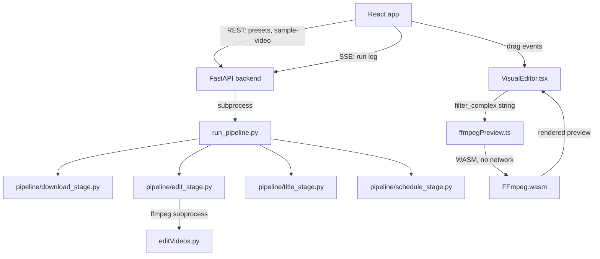

# Pipeline UI React + Visual Branding Editor Design

**Spec**: `.specs/features/pipeline-ui-react-visual-editor/spec.md`
**Status**: Approved (ported from `docs/superpowers/specs/2026-07-27-pipeline-ui-react-visual-editor-design.md`, produced via the brainstorming skill and already approved by the user)

---

## Architecture Overview

React frontend (Vite) talks to a dedicated FastAPI backend over REST + SSE.
The backend reuses `pipeline/*` unchanged for all real batch processing. The
visual editor runs FFmpeg.wasm entirely client-side for live preview — no
server round-trip while dragging.



---

## Code Reuse Analysis

### Existing Components to Leverage

| Component | Location | How to Use |
| --- | --- | --- |
| Download/edit/title/schedule stages | `pipeline/*.py` | Import unchanged in FastAPI routes and `run_pipeline.py` subprocess, no logic changes |
| `editVideos.py` overlay/delogo filter logic | `editVideos.py` | Extend `build_filter_complex`/`POSITIONS` to accept explicit `x,y`; mirror the exact same filter string client-side in `ffmpegPreview.ts` |
| Preset JSON format | `pipeline_ui/configs/*.json` | Same file format and directory convention, just written/read by FastAPI instead of Flask |
| SSE log streaming pattern | `pipeline_ui/app.py::stream_run` | Same tail-the-log-file-from-start-on-connect approach, ported to a FastAPI `StreamingResponse` |
| Single-run lock | `pipeline_ui/app.py::ACTIVE_RUN` | Same in-memory dict pattern, ported to FastAPI app state |

### Integration Points

| System | Integration Method |
| --- | --- |
| `run_pipeline.py` | FastAPI's `runs` route launches it as a subprocess exactly like today's Flask route (`-u` flag, stdout to a log file) |
| Sample video fetch | FastAPI's `sample_video` route calls `pipeline.download_stage.run()` with `video_count: 1`, same as today's `/preview` route |

---

## Components

### Backend: `presets.py`

- **Purpose**: CRUD for preset JSON files
- **Location**: `pipeline_ui/backend/routes/presets.py`
- **Interfaces**:
  - `GET /api/presets` -> list of preset names
  - `GET /api/presets/{name}` -> preset JSON
  - `POST /api/presets` -> save preset JSON, re-validates via `pipeline.config.load_config`
- **Dependencies**: `pipeline/config.py`
- **Reuses**: Today's `list_presets`/`load_preset`/`save_and_validate` logic in `app.py`

### Backend: `sample_video.py`

- **Purpose**: Fetch (or reuse) one sample video for a profile
- **Location**: `pipeline_ui/backend/routes/sample_video.py`
- **Interfaces**:
  - `POST /api/sample-video` (body: `profile_url`) -> `{video_url}` (served as a static file)
- **Dependencies**: `pipeline/download_stage.py`
- **Reuses**: Today's `/preview` route's sample-fetching logic

### Backend: `runs.py`

- **Purpose**: Launch batch runs, stream logs
- **Location**: `pipeline_ui/backend/routes/runs.py`
- **Interfaces**:
  - `POST /api/runs` (body: preset + start_date + dry_run) -> `{run_id}`, 409 if a run is already active
  - `GET /api/runs/{run_id}/stream` -> SSE stream of the log file, replays from start on (re)connect
- **Dependencies**: `run_pipeline.py`, in-memory `ACTIVE_RUN` app state
- **Reuses**: Today's subprocess-launch and SSE tail-the-file pattern

### Frontend: `VisualEditor.tsx`

- **Purpose**: Free-drag positioning of watermark-region and logo/icon overlays with live preview
- **Location**: `pipeline_ui/frontend/src/components/VisualEditor.tsx`
- **Interfaces**:
  - Props: `sampleVideoUrl: string`, `initialConfig: EditConfig`, `onConfirm: (config: EditConfig) => void`
- **Dependencies**: `ffmpegPreview.ts`, `@ffmpeg/ffmpeg`
- **Reuses**: None (new component); the filter logic it constructs mirrors `editVideos.py::build_filter_complex`

### Frontend: `ffmpegPreview.ts`

- **Purpose**: Build the ffmpeg `filter_complex` string from drag coordinates and run it via FFmpeg.wasm on a trimmed sample clip
- **Location**: `pipeline_ui/frontend/src/lib/ffmpegPreview.ts`
- **Interfaces**:
  - `buildFilterComplex(config: EditConfig, canvasSize: {w:number,h:number}): string` — pure function, unit-testable
  - `renderPreview(videoFile: File, filterComplex: string): Promise<Blob>` — invokes `@ffmpeg/ffmpeg`
- **Dependencies**: `@ffmpeg/ffmpeg`
- **Reuses**: Mirrors `editVideos.py::build_filter_complex`'s filter string construction

---

## Data Models

### `EditConfig` (extends today's `edit` config section)

```typescript
interface OverlayPosition {
  x: number; // pixels, in the output canvas coordinate space (e.g. 1080x1920)
  y: number;
}

interface EditConfig {
  logo_path: string;
  icon_path: string;
  logo_position: OverlayPosition | LegacyPositionName; // LegacyPositionName: "top-left" | "top-right" | "bottom-left" | "bottom-right" | "center"
  icon_position: OverlayPosition | LegacyPositionName;
  watermark_region: string; // "x0,y0,x1,y1" fractions 0-1, unchanged from today
  captions_enabled: boolean;
  background_blur: boolean;
}
```

**Relationships**: Nested under `edit` in the same preset JSON structure
`pipeline/config.py` already validates (`run_name`, `download`, `edit`,
`schedule`).

---

## Error Handling Strategy

| Error Scenario | Handling | User Impact |
| --- | --- | --- |
| FFmpeg.wasm fails to load/init | Catch load error, switch editor to static-frame mode | Editor still usable, just without live video preview |
| Sample video download fails | Surface `DownloadError` message from backend | Clear error text in the editor, same as today's `/preview` |
| Drag coordinates out of frame bounds | Clamp in `VisualEditor.tsx` before calling `renderPreview` | Box visually stops at the frame edge, never sends invalid coordinates |
| Watermark region resized to ~0 | Enforce a minimum width/height in the drag handler | Resize handle stops shrinking past the minimum |
| Second run started while one is active | FastAPI route returns 409, same as today | Frontend shows "a run is already active" |

---

## Tech Decisions

| Decision | Choice | Rationale |
| --- | --- | --- |
| Backend language | Python/FastAPI (not Node) | Reuses `pipeline/*` unchanged; a Node rewrite would duplicate all download/edit/schedule logic for no functional gain |
| Live preview mechanism | FFmpeg.wasm (client-side) | Only option that gives true live/instant feedback while dragging, per user's explicit choice over server-round-trip or static-frame-only approaches |
| Production serving | FastAPI serves the built React static bundle | Keeps deployment to one process/one port, matching the "simple local tool" nature of the project |
| Overlay coordinate format | Explicit `{x,y}` in output-canvas pixel space, with legacy named-position strings still accepted | Enables true free-drag while not breaking presets saved before this change |
